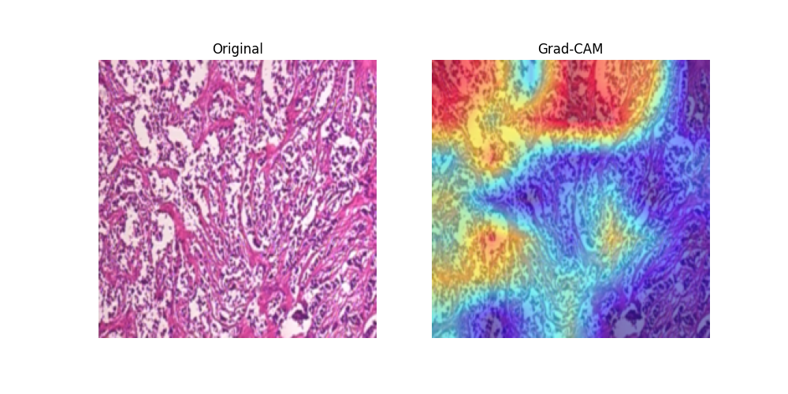
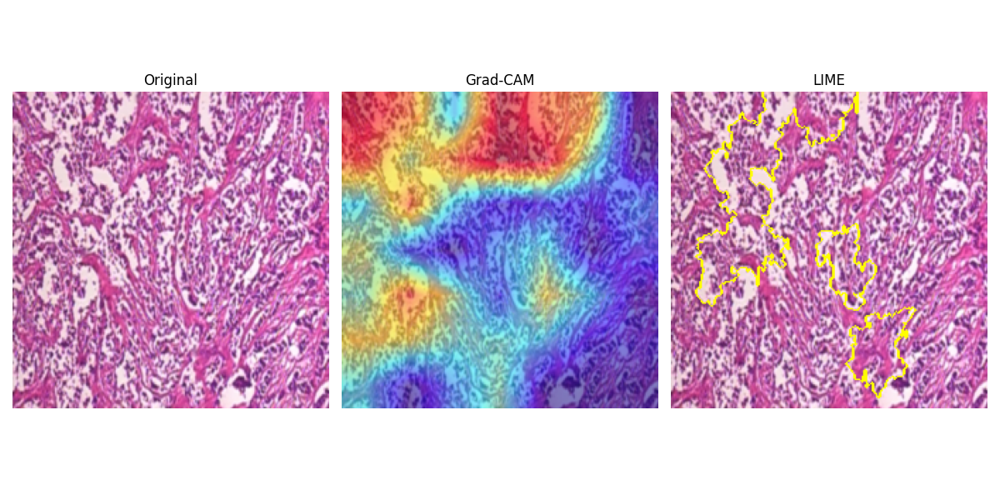

# Breast Tumour Analysis with Explainable AI (XAI)

This project performs **breast tumour classification** using histopathological images and integrates **Explainable AI (Grad-CAM, LIME)** to visualize and interpret model decisions.  It leverages the **BreakHis dataset** and deep learning architectures (CNNs / Vision Transformers) to build interpretable diagnostic systems.

---

## Setup

### Create a Python Virtual Environment
```bash
python -m venv venv
source venv/bin/activate      # macOS/Linux
# On Windows:
venv\Scripts\activate
````

### Install Requirements

```bash
pip install -r requirements.txt
```

---

## 🧬 Dataset — BreakHis

**Source:** [BreakHis Dataset on Kaggle](https://www.kaggle.com/datasets/tathagatbanerjee/breakhis-breast-cancer-histopathological)
**Images:** 7,909 histopathology images
**Magnifications:** 40×, 100×, 200×, 400×
**Classes:** Benign / Malignant (with subtypes)

| Tumor Type    | Subtypes                                                                                         |
| ------------- | ------------------------------------------------------------------------------------------------ |
| **Benign**    | Adenosis (A), Fibroadenoma (F), Phyllodes Tumor (PT), Tubular Adenoma (TA)                       |
| **Malignant** | Ductal Carcinoma (DC), Lobular Carcinoma (LC), Mucinous Carcinoma (MC), Papillary Carcinoma (PC) |

Each image filename encodes biopsy method, class, subtype, patient ID, and magnification.
Example:
`SOB_B_TA-14-4659-40-001.png` → Benign, Tubular Adenoma, 40× magnification.

---

## ⚙️ Environment Requirements

* Python ≥ 3.9
* Framework: **PyTorch** (preferred) or TensorFlow
* Key libraries:

  * `torch`, `torchvision`
  * `scikit-learn`, `albumentations`
  * `grad-cam`, `lime`
  * `streamlit` (for deployment/visualization)

---

## Project Workflow

### Step 1: Dataset Splitting — `split_by_patient.py`

* Shuffle and split patients into **train/val/test = 70/10/20**.
* Copy images into structured folders under `processed/`.
* Final counts:

  * **Train:** 5,463 images
  * **Val:** 733 images
  * **Test:** 1,713 images

---

### Step 2: Image Pre-processing — `preprocess_images.py`

* Resize every image to **224×224 px**.
* Convert to **RGB (3 channels)**.
* Save into `data/preprocessed/` maintaining the same split hierarchy.

---

### Step 3: Dataset & DataLoader (PyTorch)

**Transforms**

```python
# Training
Resize(224, 224)
RandomHorizontalFlip()
RandomVerticalFlip()
ToTensor()
Normalize(mean=ImageNet_mean, std=ImageNet_std)

# Validation/Test
Resize(224, 224)
ToTensor()
Normalize(mean=ImageNet_mean, std=ImageNet_std)
```

**Dataset Loading**

```python
train_ds = ImageFolder(DATA_ROOT / "train", transform=train_tfms)
val_ds = ImageFolder(DATA_ROOT / "val", transform=eval_tfms)
test_ds = ImageFolder(DATA_ROOT / "test", transform=eval_tfms)
```

**Class Distribution**

| Split | Total | Benign | Malignant |
| ----- | ----- | ------ | --------- |
| Train | 5463  | 1622   | 3841      |
| Val   | 733   | 190    | 543       |
| Test  | 1713  | 668    | 1045      |

Observed class imbalance → handled during training via sampling or weighted loss.

**DataLoaders**

```python
train_loader = DataLoader(train_ds, batch_size=32, shuffle=True, num_workers=4)
val_loader   = DataLoader(val_ds, batch_size=32, shuffle=False, num_workers=4)
test_loader  = DataLoader(test_ds, batch_size=32, shuffle=False, num_workers=4)
```

Verified batch shape `[32, 3, 224, 224]` and correct label mapping.

---

### Model Overview

This project leverages **deep transfer learning** to classify breast tumor histopathological images into **benign** and **malignant** categories.
Three pre-trained CNN architectures were evaluated and compared for performance:

1. **ResNet-50** – served as a strong baseline model for feature extraction and binary classification.
2. **DenseNet-121** – provided deeper gradient flow and improved feature reuse, achieving competitive accuracy and macro-F1 scores.
3. **KimiaNet** – a specialized model pre-trained on large-scale **histopathology datasets**.

   * Unlike generic ImageNet models, KimiaNet is trained to capture **microscopic tissue-level features**, making it highly effective for medical image analysis.
   * In this project, KimiaNet demonstrated superior performance with an accuracy of **86.6%** and a macro-F1 score of **85.1%** on the test set.

---

### Using KimiaNet Weights

To use KimiaNet in this project, you must first download the pre-trained weights file:
**`KimiaNetPyTorchWeights.pth`**

You can download the weights from the following source:
[KimiaNet Weights – Download Link](https://github.com/KimiaLabMayo/KimiaNet/tree/main/KimiaNet_Weights/weights)

Once downloaded, place it in the directory:

```
weights/KimiaNetPyTorchWeights.pth
```

The model loading function will automatically load these weights during initialization:

```python
model = build_kimianet(weights_path="weights/KimiaNetPyTorchWeights.pth", num_classes=2)
```

---

## Folder Structure

```
breast-tumour-analysis-xai/
│
├── data/
│   ├── raw/
│   ├── processed/
│   └── preprocessed/
│
├── runs/
│   
│
├── src/
│   ├── split_by_patient.py
│   ├── preprocess_images.py
│   ├── train.py
│
├── weights/
│   └── model.pt  # (ignored in .gitignore)(kimianet weights)
│
├── requirements.txt
├── .gitignore
└── README.md
```

---

## Explainable AI (XAI)

### Techniques Used:

* **Grad-CAM** : Visualizes important regions influencing model predictions.
* **LIME** : Generates local explanations for individual predictions.

Helps in validating model reliability and improving transparency in clinical contexts.

### Understanding Model Decisions

To interpret model predictions, Explainable AI (XAI) techniques such as Grad-CAM and LIME were applied. These visualization methods reveal which regions of histopathology images influenced the model’s decision, enhancing interpretability and trust in the diagnostic process. First experimented on a single test image to interpret KimiaNet’s decision-making process using Grad-CAM and LIME. 

```python
src\gradcam_kimianet_singletest.py
src\gradcam+lime_kimianet_singletest.py
```

### Step 1: Grad-CAM (Gradient-weighted Class Activation Mapping)

Grad-CAM generates a heatmap over the input image, highlighting the most influential areas contributing to the prediction.

In this analysis, a test image from the malignant class was processed through the trained KimiaNet model.
The Grad-CAM output indicated that:

* The model’s attention followed tissue patterns rather than background noise.

* High-activation zones aligned with cellular and structural boundaries.

Example Visualization:



* The visualization confirms that the model focuses on clinically relevant regions.

* The Grad-CAM heatmap shows smooth, spatially coherent regions of red/yellow overlay. These correspond to:

* High-attention zones where the network’s feature maps have high activation.

* In this case, those red/orange streaks follow dense epithelial glands with irregular, hyperchromatic nuclei—classic malignant morphology in ductal carcinoma.

* Cooler regions (blue/purple) represent connective stroma or empty lumens, which are less diagnostically relevant.

Conclusion: Grad-CAM is focusing on histologically meaningful tumor structures — a strong qualitative validation that the model’s attention aligns with true malignant regions.
	
### Step 2: LIME (Local Interpretable Model-Agnostic Explanations)

LIME was used to further interpret model behavior on the same image. It perturbs image regions (superpixels) and analyzes their influence on prediction confidence.

LIME divides the image into super-pixels and perturbs them to see which ones most change the prediction.

Example Visualization:



Here:

* Yellow outlines encircle compact glandular clusters with high nuclear density.

* The algorithm identifies multiple discrete “patches” within the malignant areas.

* LIME’s selections overlap quite well with the high-intensity Grad-CAM regions, though they’re more fragmented — expected, since LIME operates at the patch level rather than via feature maps.

Conclusion:
LIME and Grad-CAM are consistent — both emphasize similar epithelial tumor zones rather than background tissue.
This convergence increases confidence that the model isn’t relying on artifacts (like slide corners or staining intensity) but on morphologic cues actually indicative of malignancy.


### Rationale for Single-Image Analysis

The single-image analysis stage was performed to:

* Validate the Grad-CAM and LIME visualization pipelines before applying them to all test samples.

* Qualitatively assess focus areas and interpretability.

* Ensure consistency in color maps, normalization, and visualization settings.

After verification, the process was scaled to 40 test samples for a comprehensive evaluation of both benign and malignant categories.

---

## Future Scope

* The project can be expanded to multi-class classification by incorporating additional breast tumour subtypes and larger datasets.

* Future models can aim to identify the exact malignant tumour type rather than just binary classification.

* The outputs of all analyses (predictions) are stored in .json format under each runs/ folder, enabling further automated evaluation and visualization.

---

## References

* F. A. Spanhol, L. S. Oliveira, C. Petitjean and L. Heutte, "A Dataset for Breast Cancer Histopathological Image Classification," in IEEE Transactions on Biomedical Engineering, vol. 63, no. 7, pp. 1455-1462, July 2016, doi: 10.1109/TBME.2015.2496264.
keywords: {Cancer;Microscopy;Databases;Histograms;Biopsy;Feature extraction;Malignant tumors;Breast cancer;histopathology;image classification;Medical imaging;Breast cancer;histopathology;image classification;medical imaging},

* Alom, M.R., Farid, F.A., Rahaman, M.A. et al. An explainable AI-driven deep neural network for accurate breast cancer detection from histopathological and ultrasound images. Sci Rep 15, 17531 (2025). https://doi.org/10.1038/s41598-025-97718-5
